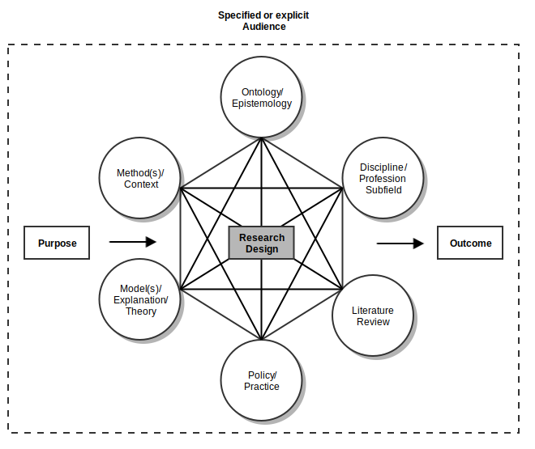

# Structure of the course {#course-structure}

## An overview {#course-overview}

### Some mechanics

This course meets twice a week, on Mondays at 13:00, and on Wednesdays
at 10:00 for three hours; but the course only runs for the first six
weeks of the semester. Thus, the average student should expect to
spend 20 hours per week on course related activities. My office is in
room 439, of the Owen G. Glenn Building (260-439), and---during term
time---I have office hours on Wednesday at 15:00. My email address is
`mail@petersmith.org`.

### Not so mechanistic: My assumptions about you

Having completed BUSINESS 710,^[You should have completed some form of
research design course before undertaking this course.] you should
have a sense of the *academic conversation* in which you wish to
participate. This implies that you can locate that discussion in terms
of: the discipline/sub-field to which it belongs; the ontology and
epistemology upon which the conversation is based; the (types) of
theories that are typically used; the journals that are relevant; and
the appropriate methodological position
[@huff_2009_designingresearchpublication p. 7]. Everything else being
equal, your choices regarding research method are a function of your
choice of academic conversation. 

Part of the process of qualitative research is, hopefully, increasing
clarity regarding that conversation. It is not unusual to still be
getting clear on your conversation even at the very last stages of
doing research; e.g., responding to feedback from reviewers of papers
when trying to publish your research.

 You do not need to base your work in
this course on the research proposal you prepared in BUSINESS 710. But
you do need to have a sense of the conversation to which you want to
participate.

My second assumption is that---sooner or later in your academic
career---you will want to make a contribution to that conversation;
i.e., you will need to design and undertake some research (albeit that
the specific design of that research will be shaped by a range of
factors beyond your research question, as shown
in Figure \@ref(fig:huff51).


```{r huff51, fig.show='hold', fig.cap='Design decisions connecting research purpose and outcomes [@huff_2009_designingresearchpublication p. 86].', echo=FALSE}


```

## The general structure of the course

This course is divided into five major topics: *You and qualitative
research*, *Qualitative methods*, *Collecting qualitative data*,
*Analysing qualitative data*, and *Presenting your results*. However,
to maximise the amount of time you can spend practising with the tools
and techniques of qualitative methods, the course is structured around
three concurrent streams of activities:

1. Knowledge of qualitative research methods in general.
2. Skills in using the various techniques and tools of qualitative
   research.
3. Knowledge of the position of qualitative research methods in your
   chosen academic conversation.

*Work stream 1* activities will largely take place inside the class;
e.g., practising doing interviews, but will also require work outside
of the too, such as developing an interview schedule.

Activities relating to *Work stream 2* mainly be addressed through tasks
regarding specific readings (e.g., from the textbooks).

In contrast, *work stream 3* activities will be based around you
identifying and reading around your specific research conversation,
and bringing those insights into the classroom to share with your
colleagues.

You will do most of the tasks around work streams 2 and 3 outside of
the classroom.

## Topic guide

+------+-------------------------+----------------------------------------------+
| Week | Knowledge focus         | Skill focus                                  |
+------+-------------------------+----------------------------------------------+
| 1    | **You and qualitative   | **Collecting qualitative data**              |
|      | research methods**      |                                              |
|      |                         |  * Interviews                                |
+------+-------------------------+----------------------------------------------+
| 2    | **Research methods**    | * Focus groups                               |
|      |                         | * Participant observation                    |
|      | * Action research       |                                              |
+------+-------------------------+----------------------------------------------+
| 3    | * Case study research   | * Archival research                          |
|      |                         |                                              |
|      |                         | **Analysing qualitative data**               |
|      |                         |                                              |
|      |                         | * Thematic analysis                          |
+------+-------------------------+----------------------------------------------+
| 4    | * Ethnographic research | * Hermeneutics                               |
|      |                         | * Semiotics                                  |
+------+-------------------------+----------------------------------------------+
| 5    | * Grounded theory       | * Narrative analysis                         |
|      |                         | * Discourse analysis                         |
+------+-------------------------+----------------------------------------------+
| 6    |                         | **Presenting your results**                  |
|      |                         |                                              |
+------+-------------------------+----------------------------------------------+

## Pattern of work

The pattern of your work in this class, is generally:

1. Complete the tasks to prepare for the classwork
3. Do exercises in class
4. Write your weekly learning journal
5. Review the learning journals that you have been allocated

## Workload

As already noted, the average student should expect to spend about 20
hours each week doing work related to this course (including class
time). To guide your efforts, I have indicated the approximate time
you should spend on each of the major tasks described in the
week-by-week guide (Chapter \@ref(week-by-week)).

A typical allocation of time to this course looks like this:

+-------------------------------+-------+
| Activity                      | Hours |
+-------------------------------+-------+
| Prep for first class          |   6   |
+-------------------------------+-------+
| Class time (first class)      |   3   |
+-------------------------------+-------+
| Prep for second class         |   6   |
+-------------------------------+-------+
| Class time (second class)     |   3   |
+-------------------------------+-------+
| Writing learning journal      |   1   |
+-------------------------------+-------+
| Reviewing learning journals   |   1   |
+-------------------------------+-------+
| Total time                    |  20   |
+-------------------------------+-------+

If you find that my estimations of the time you need is widely out,
please let me know; that way I can either:

* Help with alternate strategies for tackling the tasks, or
* Change or remove some of the tasks.

## Week-by-week in detail {#week-by-week}

My starting point in organising both the class, and the following
chapters, is to constantly focus on what I want you to be able to do
in class. Given that, what you need---in terms of resources, support,
and practice--becomes evident.

As a consequence of that approach, for each week, you will see a
high-level description (class plan) for each class. You will also see
a list of tasks that you need to do to be appropriately prepared for
the class. Whilst 'topics' in the class plan are framed as question,
your preparatory tasks are not necessarily structured to directly
answer those questions. Instead, they provide the building blocks from
which we can---together---address those questions.

Note: There are citations scattered throughout this course guide. They
are not necessarily prompts for you to do extra reading. Rather, they
point you towards the sources of ideas that are used here (should you
be so interested). Items that you are expected to read will have that
expectation explicitly stated.

## The hidden agenda

If this course has a hidden agenda it is to foster the development of
your 'qualitative mindset'; a robust link between ones espoused
epistemology and ontology and how one approaches understanding the
social world.
