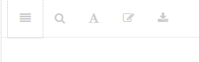

--- 
title: "BUSINESS705: Qualitative research methods"
author: "Peter Smith"
date: "`r Sys.Date()`"
site: bookdown::bookdown_site
output: bookdown::gitbook
documentclass: book
bibliography: [book.bib]
biblio-style: apa
csl: apa.csl
github-repo: psmith1303/business705
url: 'http\://courseguide.info/business705/'
cover-image: 'images/cover.jpg'
favicon: "favicon.ico"
link-citations: yes
description: "This is the Course Book for BUSINESS705, a postgraduate course in qualitative research methods."
---


# Quick-start guide {-}

Welcome to the BUSINESS705, Qualitative Research Methods.

Over the coming six weeks, I hope that you will find this an engaging
and fun course.

My overarching goal for this course is to prepare you to undertake
your first (and perhaps only) research project of any size; e.g., a
masters (60-point) dissertation or an honours (30-point) dissertation.
This is my touchstone in all my thinking regarding BUSINESS 705. To
that end, I want you to be able to *select* qualitative research
methods that are *appropriate* for your chosen academic conversation
[@huff_2009_designingresearchpublication], and to *use* those methods
in a *proficient* manner.

This course guide includes details of
the [assessments](#assessment-overview), leading to
an [overview](#course-overview) of the course.

If you have not already done so, you should familiarize yourself with
the formal [course outline](#course-outline).

 In order to learn about qualitative
research methods, you will actually use a range of research methods
and techniques. In doing so, you will act both as an *investigator* in
research and as a research *participant*. Undertaking those dual roles
is a fundamental part of the course's design. Your enrolment in this
course is taken as your implicit agreement to the being a research
participant as explained in the [participant information sheet](#pis).


## Getting started {-}

1. Read how the course fits together
([assessments](#assessment-overview),
[course overview](#course-overview), and
the [course outline](#course-outline))
2. Print out the [To Do checklist](#todo-checklist) for the course.
   This will remind you of the tasks and milestones you need to meet

Once you have done those four steps, you will be well positioned to be
successful in this course. If you have questions, please checkout
the [Frequently Asked Questions](#faq) chapter.

## Beyond the basics {-}

For those who are interested, there is information on the 'back story'
of the course. This includes:

1. How the course relates to the [MCom Postgraduate profile](#profile)
2. The [design decisions](#course-design) that guided much of what goes on
3. The [history of the course](#course-history)

## Some tips and tricks for using this e-book  {-}

### The toolbar {-}

If you are using the website version of this e-book, you should see a
toolbar at the top of the screen, see Figure \@ref(fig:toolbar).


```{r toolbar, fig.show='hold', fig.cap='The Bookdown toolbar', echo=FALSE}


```

The first 'button' turns the table of contents display on and off.

The second button allows you to search the contents of the book.

The third button, looking like a letter A, controls the styling of the
page, changing the type of font, its size, and the colour palette of
the page.

The next button allows you to edit the content of the book. More
correctly, it takes you to a copy of the source of this book
on [GitHub](https://www.github.com). If you have a GitHub account you
can then make changes to the book, for example, if you want to fix a
typo.

The final button allows you to download either a PDF or an epub
version of the book in its entirety.

### The social bar {-}

On the website version of this e-book, there are buttons to allow you
to share details of the book on Twitter, Facebook, etc.
